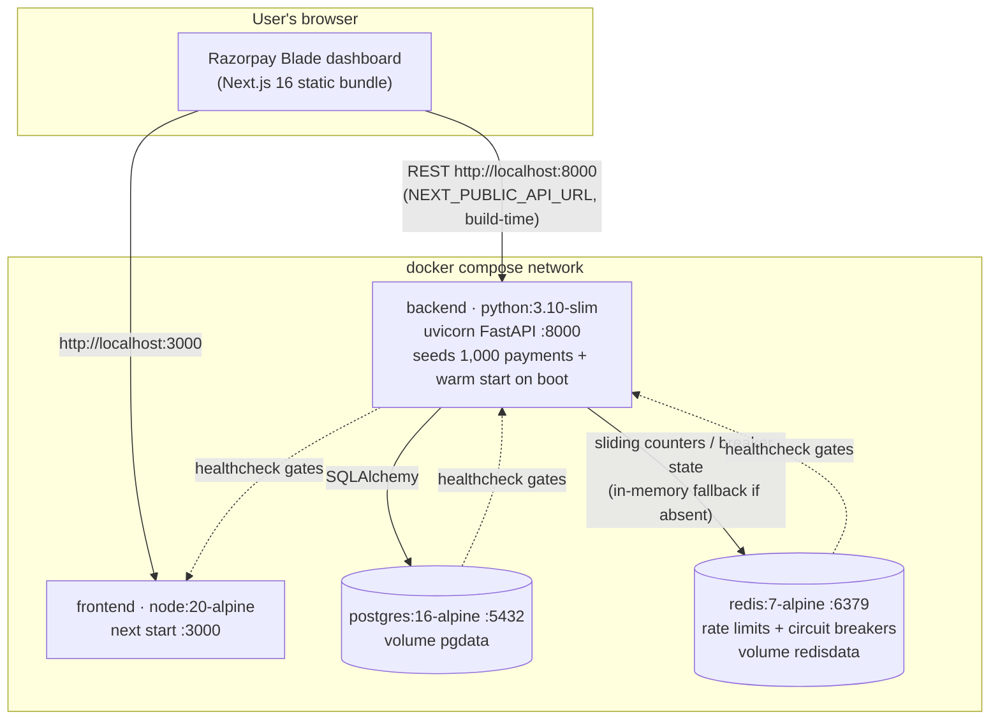
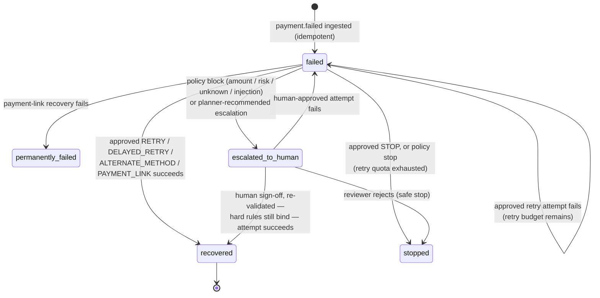
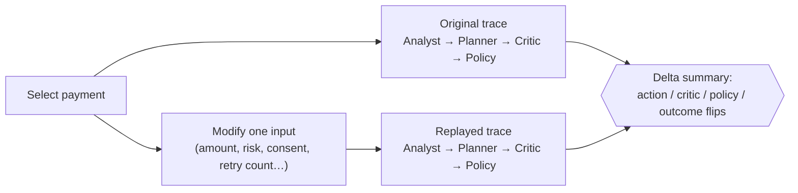

# RecoverAI System Architecture

> Core invariant: `AI proposes → Policy validates → System executes → Audit records → Metrics measure.`
> The decision-pipeline hero diagram and the policy-gate ladder live in [README.md](README.md); this document covers the runtime topology, the payment state machine, and the replay debugger.

## 1. Decision Pipeline (summary)

One code path performs recovery: `backend/app/api/recovery.py::process_full_recovery_pipeline`.

1. **Idempotency** (`core/idempotency.py`) — duplicate `event_id`s are ignored; no double execution.
2. **Payment Analyst** (`agents/payment_analyst.py`) — deterministic failure classification + pluggable payment-intelligence signals (`core/vulcan_adapter.py`, Vulcan-ready) + epistemic-uncertainty abstention.
3. **Recovery Planner** (`agents/recovery_planner.py`) — bounded action selection maximizing expected net recovery (`core/cost_optimizer.py`).
4. **Critic** (`agents/critic.py`) — an independent second opinion. A DISAGREE with a de-escalation override (HUMAN_REVIEW/STOP) is adopted *before* policy evaluation and audited (`CRITIC_OVERRIDE_APPLIED`). When the LLM layer is enabled it joins **strengthen-only**: it can add a disagreement but can never loosen one (`core/llm_reasoner.py`).
5. **Policy Engine** (`policy/engine.py`) — 8 ordered deterministic checks, fail-closed. The only authority over execution. Human approvals re-enter here with `human_approved=True`, which waives escalation-class rules only; hard rules bind even humans.
6. **Recovery Executor** (`agents/recovery_executor.py`) — simulates settlement against the seeded ground-truth outcome model (`core/outcome_model.py`); outcomes are never derived from the planner's own predictions.
7. **Audit** (`core/audit.py`) — every step appends to the tamper-evident SHA-256 hash chain; `GET /api/audit/verify` recomputes it end-to-end.

## 2. Runtime Topology (docker compose)

Boot order is health-gated: postgres/redis must be healthy before the backend starts; the backend must pass `/health` (after seeding + warm start) before the frontend starts. Local development uses SQLite and an in-memory Redis fallback — zero external dependencies.

## 3. Payment State Machine

Transitions as actually written by the executor (`agents/recovery_executor.py`) — nothing aspirational:

## 4. Time-Travel Replay Pipeline

The replay debugger re-runs the full decision pipeline **read-only** (`dry_run=True`: no state mutation, no rate-limit consumption) for any historical payment, with one input modified, and diffs the traces:

Example: raise the amount of a ₹20,000 auto-approved retry to ₹40,000 and watch the same pipeline flip to `BLOCKED → human review` at check 3.

## 5. Key Invariants

1. **No AI direct execution** — AI output is a recommendation; execution happens only through `PolicyEngine.evaluate()` (including human approvals, which are re-validated).
2. **Deterministic precedence** — if the AI claims confidence but a policy rule blocks, the decision is `BLOCKED_BY_POLICY`. Fail-closed on any engine error.
3. **Idempotency** — re-ingesting an `event_id` returns `ALREADY_PROCESSED` with no side effects.
4. **Tamper-evident auditability** — every state transition is appended to the SHA-256 hash chain via `core/audit.py::append_audit`; direct `DBAuditEvent` construction is forbidden.
5. **Honest measurement** — simulated outcomes come from the seeded ground-truth model, independent of the planner; synthetic data is labeled synthetic everywhere it appears.

## 6. Technology

| Layer | Stack |
|---|---|
| Frontend | Next.js 16 (App Router) · React 19 · **@razorpay/blade** on styled-components v5 |
| Backend | FastAPI · Pydantic v2 · SQLAlchemy |
| Data | PostgreSQL 16 (compose) / SQLite (local) · Redis 7 (rate limits, breakers) |
| AI | Optional Anthropic Claude reasoner (advisory only) · Vulcan-ready intelligence seam |
| CI | GitHub Actions — deterministic tests, lint, build, and agent-context refresh |
